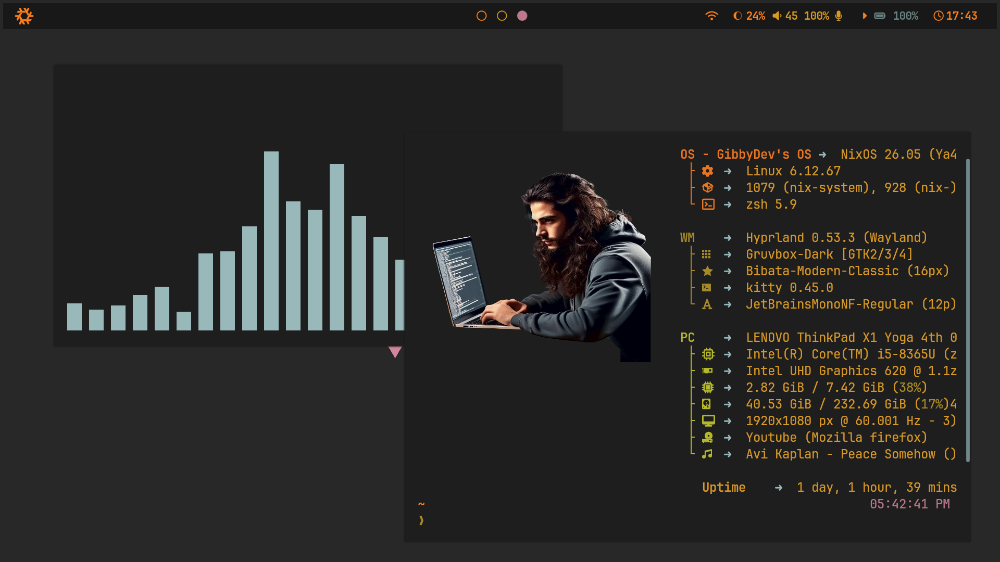
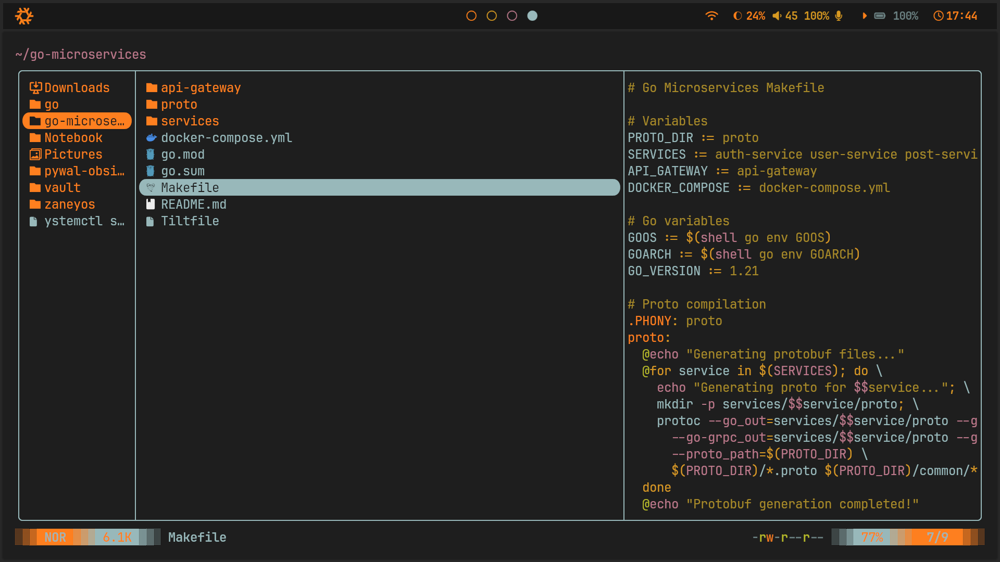
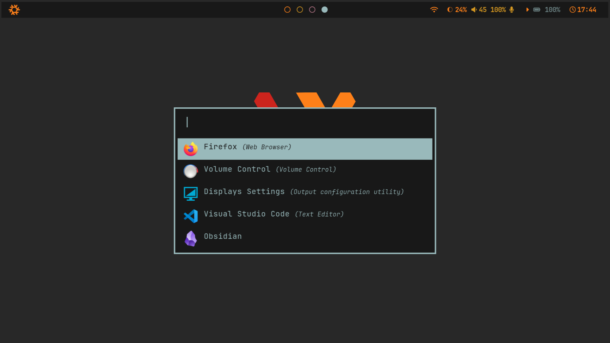
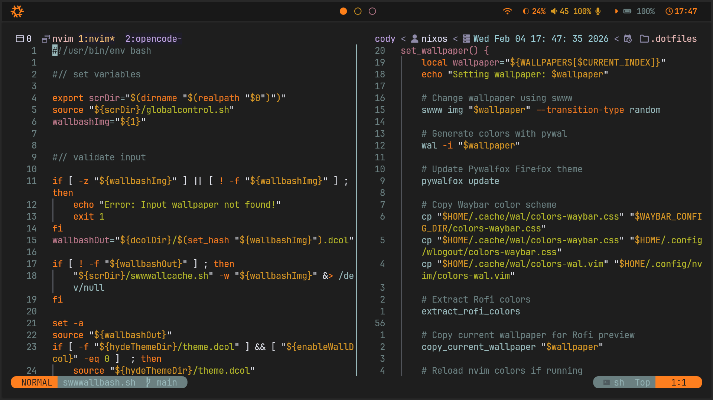
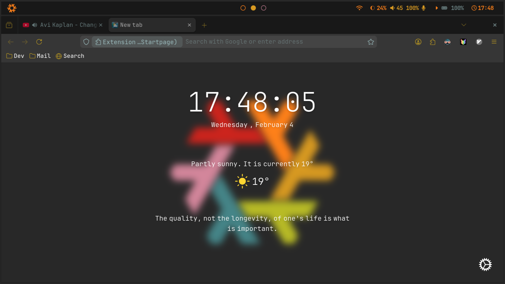
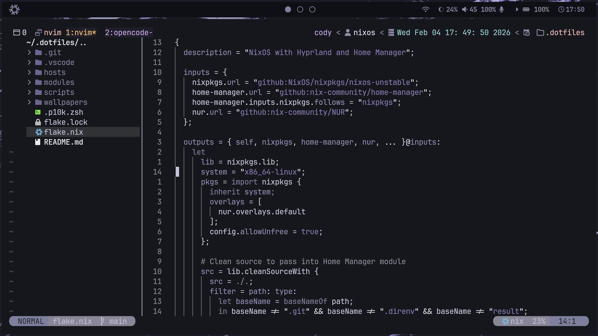
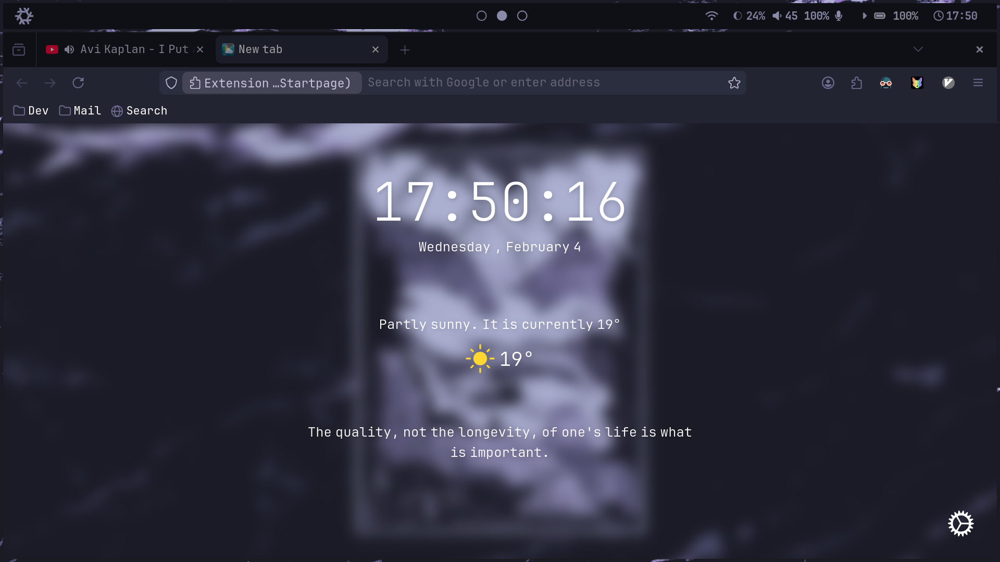
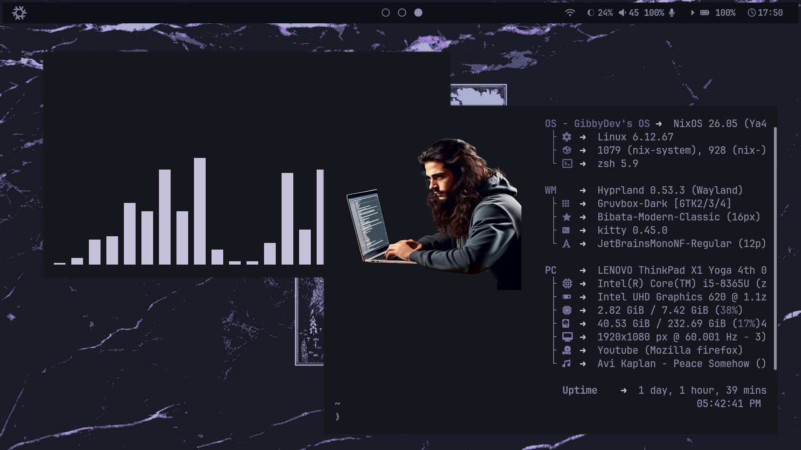
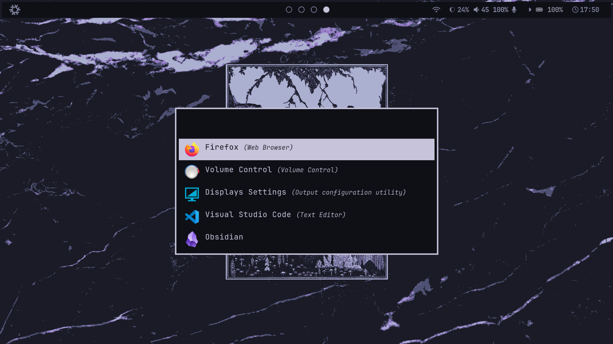
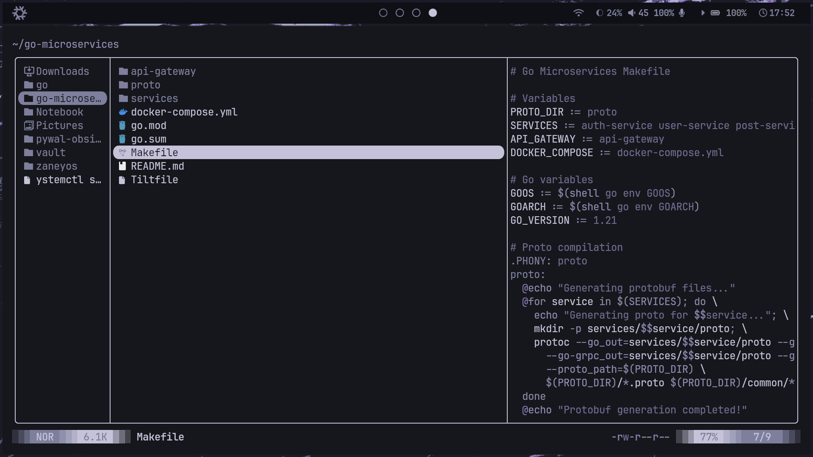

# 🖥️ ParanaOS

<!-- Desktop screenshots (actual images) -->
<p align="center">
  
  
  
  
  
  
  
  
  
  
</p>

---

## Overview

Welcome to my personal dotfiles repo! This setup uses [Nix Flakes](https://nixos.wiki/wiki/Flakes), modular shell/configuration management, and lightweight scripts to make my Linux environment highly reproducible, beautiful, and easy to customize.

**Features:**
- 🎨 Powerlevel10k Zsh theme
- 🐚 Modular configs for shell, editor, and more
- ⚡ Automated install with Nix
- 🖼️ Wallpapers for a custom look
- 🛠️ Utility scripts
- 🔒 Host-specific overrides

---

## Screenshots

<details>
<summary>Click to expand all screenshots</summary>

<p align="center">
  
  
  
  
  
  
  
  
  
  
</p>
</details>

---

## Installation & Setup

### Prerequisites
- **Linux machine** (tested with Arch, Ubuntu; works on most distros)
- **[Nix](https://nixos.org/download.html)** package manager (see https://nixos.org for install instructions)
- Optionally: [Home Manager](https://nix-community.github.io/home-manager/) for full home directory integration

### Step 1: Clone the repository

```sh
git clone https://github.com/gibbyDev/.dotfiles>.git ~/.dotfiles
cd ~/.dotfiles
```

### Step 2: Install dependencies with Nix Flakes

If you don’t have flakes enabled, run:

```sh
nix --experimental-features 'nix-command flakes' flake show
```

Run the installer to rebuild system and home manager modules:

```sh
chmod +x install.sh
./install.sh
```

Replace `<your-host>` with your hostname as defined in the `hosts/` directory.

### Step 3: Extras and Customization
- Edit (or override) configs in `modules/` for shell, editor, etc.
- Change wallpapers by replacing files in `wallpapers/`
- Update host-specific settings in `hosts/`
- Zsh theme: `.p10k.zsh` config for Powerlevel10k is included
- Additional scripts can be run or extended from `scripts/`

---

## Directory Structure

```text
.
├── flake.lock
├── flake.nix
├── hosts
│   └── template/
├── imgs
├── modules
│   ├── code/
│   ├── default.nix
│   ├── dolphin/
│   ├── fastfetch/
│   ├── firefox/
│   ├── hyprland/
│   ├── kitty/
│   ├── misc/
│   ├── nvim/
│   ├── opencode/
│   ├── rofi/
│   ├── tmux/
│   ├── virtualization/
│   ├── waybar/
│   ├── wlogout/
│   └── yazi/
├── .p10k.zsh
├── README.md
├── scripts
└── wallpapers
```

---

## FAQ & Troubleshooting
- **How do I update everything?**
  - Pull latest: `git pull`
  - Re-run the Nix install process
- **Where do I put overrides for my machine?**
  - Add files to the `hosts/` directory named after your hostname.
- **How do I contribute or fork?**
  - Make your edits, then push to your fork or PR as needed!

---

## License
MIT (or specify your own preferred license)

## Credits
Big thanks to the Nix, Home Manager, and Powerlevel10k communities!

---
